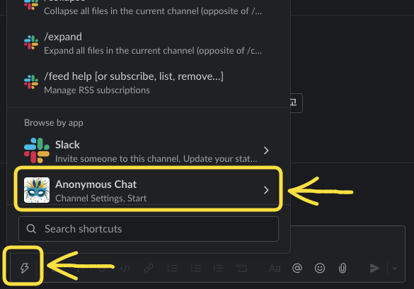
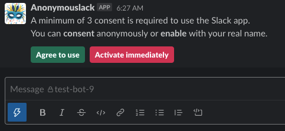
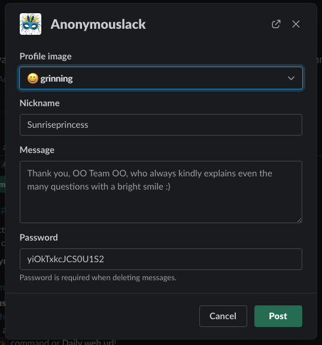
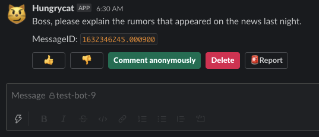

# Anonymouslack
**Say your honest opinion anonymously!**

- Anonymouslack은 슬랙 채널에 익명 메시지를 전달할 수 있습니다.
- 익명으로 쓰레드에 댓글을 남길 수 있습니다.
- 신원을 노출하지않고 안전하게 의견을 말하세요.

## Installation

1. ↓ `Add to Slack` 버튼을 클릭하여 슬랙 워크스페이스에 설치하세요.

  

> 앱 설치 권한이 없다면 워크스페이스 관리자의 승인이 필요합니다.

## Usage

1. Click **Anonymouslack** on **Shortcut**.

2. 갑작스런 익명 메시지는 동료들이 놀라게 할 수 있습니다. 익명 메시지
  사용 시작과 동의를 구하는 메시지가 처음 포스팅됩니다.

3. 동의가 완료되면 다시 **Shortcut** 메뉴를 통해 익명 글을 작성 할 수 있습니다.

4. 익명의 글에는 익명의 찬성/반대 의견을 표할 수 있고, 쓰레드를 통해
  익명으로 대화 할 수 있습니다.

조직의 건강한 소통을 위해 익명 메시지로 안전하게 의견을 전달하세요~

## Support
Since this project is open source, [Github Issues](https://github.com/ACupofCommit/anonymouslack/issues)
is the preferred support channel. However you can directly e-mail me too.

[Privacy Policy](/privacy) | Copyright © 2021 ACupofCommit
