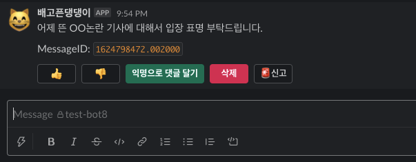

# Anonymouslack :id=home
**Say your honest opinion anonymously!**

- Anonymouslack은 슬랙 채널에서 익명을 사용할 수 있게 도와줍니다.
- 채널과 쓰레드에 익명 메시지를 남기며 대화할 수 있습니다.
- 익명으로 안전하게 의견을 말하세요.

## 설치

1. ↓ `Add to Slack` 버튼을 클릭하여 슬랙 워크스페이스에 설치하세요.

  

> 앱 설치 권한이 없다면 워크스페이스 관리자의 승인이 필요합니다.

## 사용

1. **Shortcut**에서 **Anonymouslack**를 클릭하여 사용하세요.

2. 갑작스런 익명 메시지는 동료들이 놀라게 할 수 있습니다. 익명 메시지
  사용 시작과 동의를 구하는 메시지가 처음 포스팅됩니다.

3. 동의가 완료되면 다시 **Shortcut** 메뉴를 통해 익명 글을 작성 할 수 있습니다.

4. 익명 메시지에는 찬성/반대 의견을 표할 수 있고, 악성 메시지라면
   신고 할 수 있습니다. 물론 이 기능들의 사용도 익명이 보장됩니다.

조직의 건강한 성장을 위해 익명 채널을 운영하세요~

## 지원
오픈 소스 프로젝트이므로, [Github Issues](https://github.com/ACupofCommit/anonymouslack/issues) 페이지 사용을 권장합니다.
[이메일(anonymouslack23@gmail.com)](mailto:anonymouslack23@gmail.com)로 컨택 할 수도 있습니다.

[개인 정보 정책](./privacy) | Copyright © 2021 ACupofCommit
